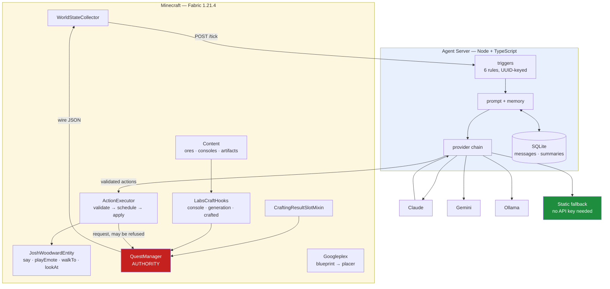

# LabsCraft v1 → v2: Rebuild Report

A record of the ground-up rebuild — what was built, how the approach differed, what it
cost, and what the numbers do and don't prove.

- **v1**: 5 commits, 2026-02-04 → 2026-02-16 (12 calendar days). Co-authored by Claude Opus 4.5 and Opus 4.6.
- **v2**: 3 commits, 2026-07-23, ~100 minutes wall clock. Orchestrated by Claude Opus 4.8, implemented by 7 Claude Fable 5 subagents.

---

## 1. Approach: how the two builds differed

**v1 — incremental, single-threaded.** Features landed in phases over 12 days: the mod
first, then the Googleplex generator, then tests, then the agent server, then proactive
behavior. Each phase built on whatever the last one left behind. Verification was
largely "it compiles and the unit tests pass."

**v2 — spec-first, gated, parallel, runtime-verified.** Four deliberate changes:

### 1.1 Extract the design before deleting the code

v1 was read and distilled into a spec *before* deletion: the feature inventory, the
known-good toolchain versions, Josh's character prompt, and a catalogue of **10 concrete
defects** to avoid repeating. The rebuild inherited v1's design without inheriting v1's bugs.

> This is the single biggest reason v2 is better, and it is **not** a model-capability
> effect. v2 started with a defect list that v1 had to discover the hard way.

### 1.2 Freeze the wire contract first

A `PROTOCOL-V2` document defined the mod↔server contract before either side was written.
The Java and TypeScript halves were then built **simultaneously by different agents** who
never saw each other's code. On integration they produced **zero breaking mismatches** —
only three cosmetic observations, one of which (a missing `VIDEO_LAUNCH` fallback line)
was fixed in a two-minute follow-up.

### 1.3 Hard gates with runtime proof

Each gate had to be *demonstrated*, not asserted. G0 didn't pass on `BUILD SUCCESSFUL`;
it passed on a live server printing `Loading 43 mods: labscraft` → `Done (0.364s)!`.

The strongest example: a fake player driven through **real** server code paths —
`PlayerBlockBreakEvents`, the crafting mixin's injected bytecode, and a real placed
console's 100-tick ticker — advancing the quest line `NOT_STARTED → VIDEO_LAUNCH`.

```
[SMOKETEST] PASS: block-mined path: mine_tpu_ore incremented 1->2->3 via real tryBreakBlock
[SMOKETEST] PASS: crafting mixin path: craft_tpu progress incremented 1 then 2 (done)
[SMOKETEST] PASS: generation path: GENERATION_COMPLETED fired by real console ticker
[SMOKETEST] ALL PASS — quest wiring verified end to end at runtime
```

### 1.4 Design for testability against a hostile constraint

Minecraft's test classpath isn't remapped, so tests cannot import game classes. v1's
response was a 413-line test for the Googleplex generator that could only assert trivia.
v2 splits every subsystem into a **pure-Java layer** (no Minecraft imports, thoroughly
tested) plus a thin game-facing wrapper. The Googleplex blueprint layer now tests
non-overlap, sealed shell, and BFS reachability of every room — with 8 sabotage tests
proving each validator check actually fires.

---

## 2. System map



Two invariants the map encodes:

- **`QuestManager` is the authority** (red). `ADVANCE_QUEST` from an LLM is a *request*
  it can refuse, naming the unmet objectives. Tested with a 50-call spam attempt.
- **The static fallback is terminal** (green). The chain always resolves, so the game
  is playable with the server down *and* with the server up but no API keys configured.

---

## 3. Stats

### Code

| | v1 | v2 | Δ |
|---|---:|---:|---:|
| Java LOC | 5,391 | 9,435 | +75% |
| TypeScript LOC | 1,394 | 2,670 | +92% |
| Main Java files | 40 | 76 | +90% |
| Test Java files | 6 | 20 | +233% |
| TS source / test files | 13 / 0 | 15 / 6 | — |
| Resource JSON | 34 | 44 | +29% |
| **Tests passing** | **148** | **214** (163 JVM + 51 TS) | **+45%** |
| Quest stages | 5 | 6 | +1 |
| Custom packet classes | 4 | 0 | eliminated |
| Mixins declared / used | 1 / 0 | 1 / 1 | fixed |

### Correctness

| Defect (v1) | Status in v2 |
|---|---|
| Consoles produced nothing — progress bar, no output | Fixed: TPU consumed → real flavored artifacts |
| Quest objectives never populated | Fixed: event-driven, first-class |
| `FIRST_GENERATION` unreachable (empty `if` block) | Fixed: hook fires on `lifetimeCompleted == 1` |
| Ore dropped nothing (`requiresTool()`, no block tags) | Fixed: tags shipped, Fortune + Silk Touch |
| `delay_ticks` unreliable (two unrelated clocks) | Fixed: single monotonic tick source |
| LLM output hand-parsed from prose | Fixed: structured tool-calling + schema |
| Trigger state leaked (global name-keyed maps) | Fixed: UUID-keyed, TTL eviction |
| Emotes were italic chat text | Fixed: synced animation + particles |
| `markDirty()` on every read | Fixed: mutation only |
| `canPlayerUse()` always `true` | Fixed: real distance check |

Two of these — the ore tags and the unreachable quest stage — were **not** in the
original defect list. They were discovered by agents during the rebuild.

### Cost (v2, measured)

| Metric | Value |
|---|---|
| Subagents | 7 (Fable 5) |
| Subagent tokens | **1,150,467** |
| Tool calls (subagents) | 415 |
| Cumulative agent time | ~110 min |
| **Wall clock** | **~100 min** |
| Peak parallelism | 3 agents |

Per-gate:

| Gate | Scope | Tokens | Tools |
|---|---|---:|---:|
| G0 | Build skeleton | 35,528 | 26 |
| G1 | Content | 153,377 | 80 |
| G2 | Quests | 94,930 | 43 |
| G3 | Josh + integration | 172,088 | 84 |
| G4 | Agent server | 398,712 | 44 |
| G5 | Agent bridge | 175,420 | 84 |
| G6 | Googleplex | 120,412 | 54 |

Parallel scheduling made wall clock (~100 min) shorter than cumulative agent time
(~110 min) despite 7 agents, because G1+G2+G4 and G5+G6 ran concurrently.

---

## 4. What these numbers do not prove

Stated plainly, because the temptation to overclaim here is obvious:

1. **No token comparison against v1 is possible.** v1 predates this session; git
   preserves commits and dates, not token counts. Any "v1 used N tokens" figure would be
   invented. The 12-days-vs-100-minutes gap is real but not like-for-like — those 12
   calendar days include the user's own thinking, iteration, and play-testing, not 12 days
   of continuous model work.

2. **This is not a clean Fable-vs-Opus comparison.** v2 was orchestrated by **Opus 4.8**
   and implemented by **Fable 5**. The wins attributable to orchestration — spec
   extraction, a frozen protocol, gate discipline, file-ownership rules that let agents
   run in parallel without conflicts — are Opus's contribution, not evidence about Fable.

3. **The starting conditions were asymmetric, heavily in v2's favour.** v1 had to
   discover the design. v2 was handed the design *plus* a list of v1's ten worst bugs.
   A rebuild with the answer key should beat the original; that is the point of a
   rebuild, not proof of model superiority.

4. **n = 1.** One project, one run, no controls.

What the numbers *do* support: **the method works.** Spec-first extraction, a frozen
interface contract, parallel agents with disjoint file ownership, and gates that demand
runtime evidence produced more code, substantially more test coverage, and ten fixed
defects in a fraction of the elapsed time — and the two independently-built halves
integrated with zero breaking mismatches.

---

## 5. Known gap

**`runClient` was never run.** All verification is headless dedicated-server. Josh's
renderer and model, the emote arm-posing, the console GUI screens, and the spawn egg
visuals are compile- and unit-test-verified only — never rendered on screen.

The client asset JSONs mirror v1's structure, which *was* client-verified, so the risk is
moderate rather than open-ended. But the user's stated acceptance bar was "launch client,
talk to Josh, complete the quest line," and the client half of that remains unproven.
It is listed here rather than quietly omitted.
